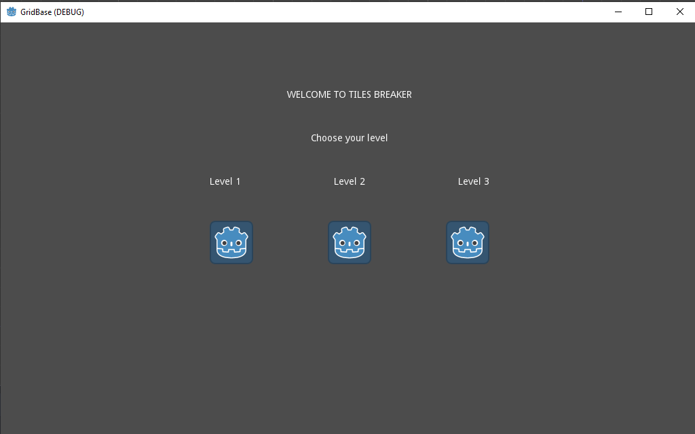
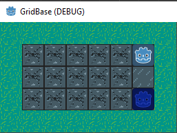
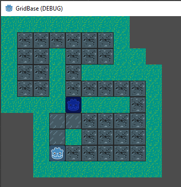
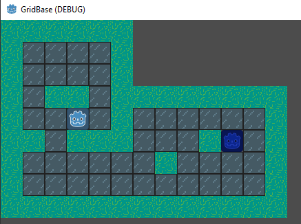

# Tiles-breaker
A very simple game made to try out the free godot game engine
# Rules:
The goal is to reach the end level tile without falling in a hole

You falls in a hole if you walks two times on the same tile

You can only finish the level if you've walked on every tile once

# Potentials Upgrades
Add levels, add portals, add better art, add lives to the player, well a lot

The way the level changes should not be with an if-else statement, but with a level variable (int)\
\
Level 1\
\
Level 2\
\
Level 3\
\
